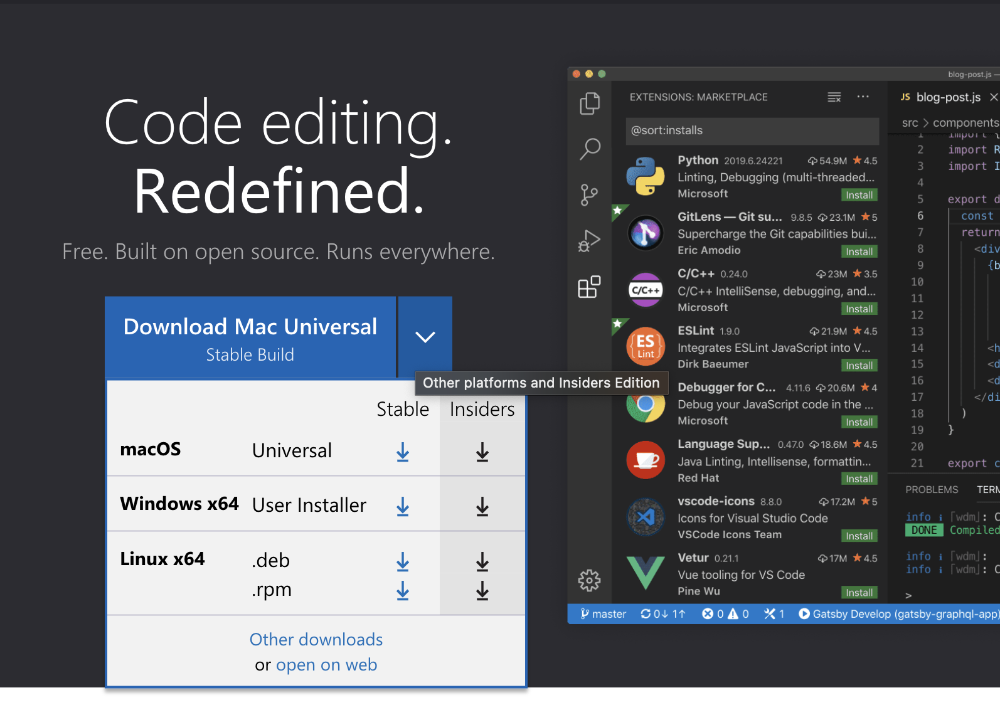

Lab1: Markdown, URLs, Paths, and the Filesystem

You’ll submit a lab report by writing a blog post about remote access, like we just described using Github Pages. The lab report is due Monday, April 10 by 10pm. See the FAQ below for common questions, including how to add images and what to submit to Gradescope.

You will write a tutorial for incoming 15L students (and your future self!) about how to log into a course-specific account on ieng6. Your post should include all the steps you took, along with screenshots of what each step looked like. You’re free to use the screenshots you took for lab 1, or new ones. Complete any steps you didn’t complete in your group on your own.

Overall, make sure you have at least 3 screenshots, one for each of the steps below (though more is useful, remember that this will help out your future self). For each step include at least 2-3 sentences or bullet points describing what you did. If for some reason you didn’t do the step exactly, describe why not (maybe your computer already had something on it, maybe the department computers worked differently, etc).

Installing VScode
Remotely Connecting
Trying Some Commands
You should complete the writing on your own. Feel free to ask anyone (staff or other students are fine!) for help if you’re struggling to get remote access set up, understand commands, get your writing to show up on Github Pages, etc. But do not get help from anyone on authoring the report itself – the writing and screenshots must be your own.

You will upload your submission by publishing the page on Github Pages, then printing the page to PDF and uploading to the Lab Report 1 assignment on Gradescope.

Step 1: Installing VSCODE

If your computer already has VScode installed, proceed to step 2.

I. Navigate to https://code.visualstudio.com/ and follow the instructions to download and install. (More information on starting VScode for Mac OSX here: https://code.visualstudio.com/docs/?dv=osx)

II. Once fully installed, your window should look something like this:

III. 

