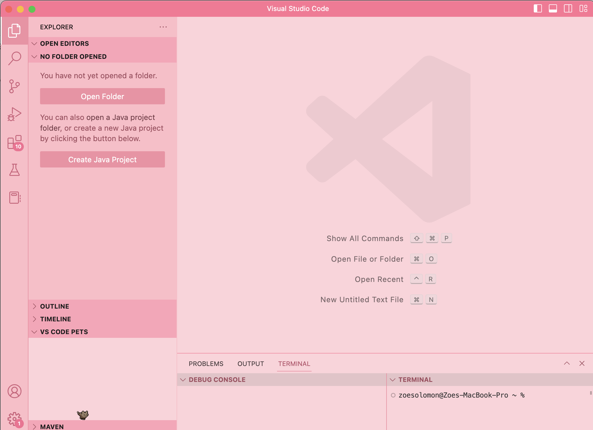
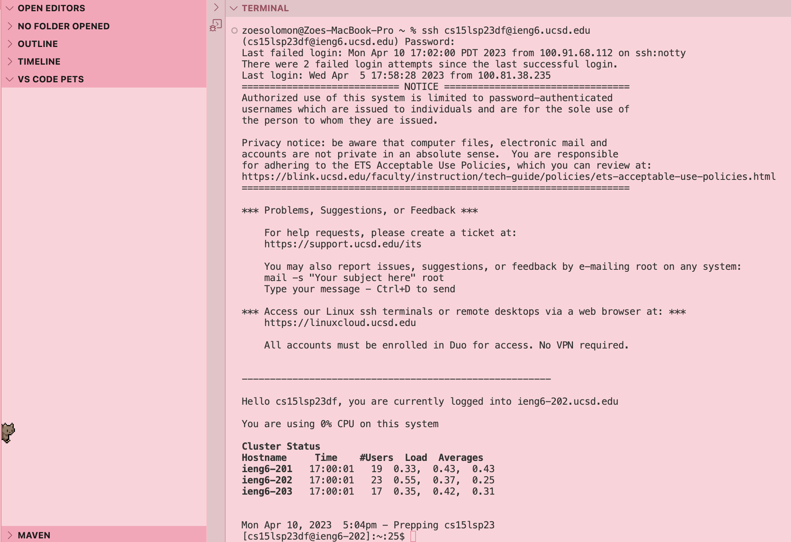
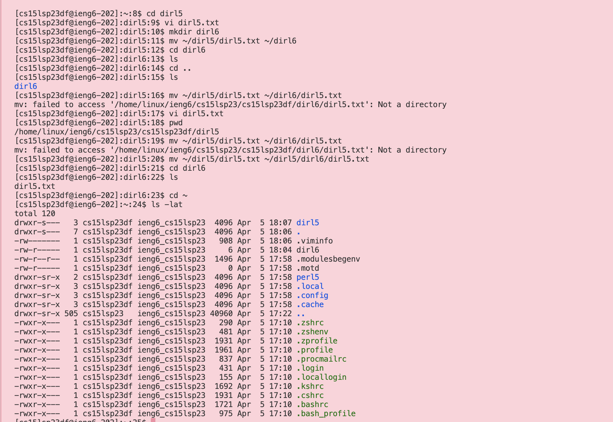

## Lab1: Markdown, URLs, Paths, and the Filesystem

This report gives instructions on remote access and the filesystem of a terminal.

### Step 1: Installing VSCODE

If your computer already has VScode installed, proceed to [Step 2](https://zoesolomon.github.io/cse15l-lab-reports/lab1.html#step-2-remotely-connecting)).

I. Navigate to the [VSCODE website](https://code.visualstudio.com/) and follow the instructions to download and install. (More information on starting VScode for Mac OSX [here](https://code.visualstudio.com/docs/?dv=osx))


II. Once fully installed, your window should look something like this:



### Step 2: Remotely Connecting

I. Open terminal in VScode

II. Use the command format `$ ssh username@host` in this case, it would be `$ ssh cs15lsp23[your two letter code]@ieng6.ucsd.edu` 

III. Input password when prompted. Your window should look something like this:



### Step 3: Trying Commands

I. Try running some commands in the terminal. Here are a few that may be useful:
```
cd ~
cd
ls -lat
ls -a
cp /home/linux/ieng6/cs15lsp23/public/hello.txt ~/
cat /home/linux/ieng6/cs15lsp23/public/hello.txt
```

For reference, in order, these commands perform these functions:

>change directory home
>
>change directory home
>
>lists all files (including hidden) in the directory in long format from most to least recently modified
>
>lists all files (including hidden) in the directory
>
>copies the file to your home directory
>
>shows the content of the file in the terminal

II. Here is an example of what some of these commands could look like:



As listed in the above commands, this screenshot shows changing directories with cd, moving files from one directory to another (mv), listing the contents of a directory (ls), printing the full path of the current directory (pwd), and listing all files (including hidden) in the directory in long format from most to least recently modified (ls -lat).
