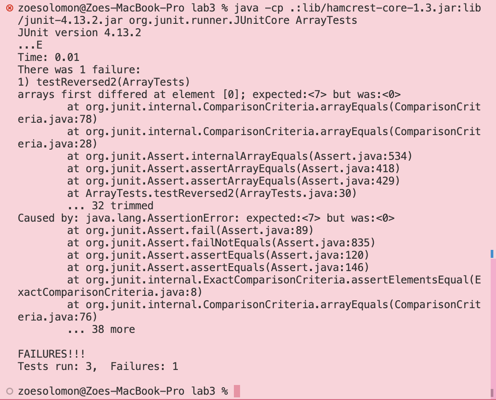
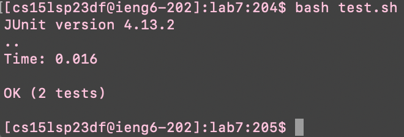

## Lab2: Servers and Bugs

This report shows examples of a server and its commands, as well as bug fixes.

## PART 1: Building a Server

Server called "String Server" that displays the query input into the math url.


In the first screenshot below, the method being called is the main method in the StringServer class, as that starts the server, while in the other screenshots it is the handleRequest method in the Handler class being called. 

The input to start the server (in the main method) is the port number, which is taken as a list parameter and saved as a field called "port" when the method instantiates a new handler. The parameters in the Handler class come from the url put into the local host. The two relevant fields in this method are the list parameter[1], which is split at the equals sign in the path, and stored the text to be added, and the String s which is concatenated with the new paramter[1] everytime there is a new inpput in the url. These values due change with specific requests, as it depends on the user input.


## PART 2: Debugging

One method in the ArrayExamples class that was buggy was the reversed method:

```
  static int[] reversed(int[] arr) {
    int[] newArray = new int[arr.length];
    for(int i = 0; i < arr.length; i += 1) {
      arr[i] = newArray[arr.length - i - 1];
    }
    return arr;
  }
```
A test that reveals a failure in this method can be seen below:

```
@Test
  public void testReversed2() {
    int[] input = {3, 5, 7};
    assertArrayEquals(new int[]{7, 5, 3}, ArrayExamples.reversed(input));
  }
```
A test that works despite the bug present in the code can be seen below:

```
@Test
  public void testReversed() {
    int[] input1 = { };
    assertArrayEquals(new int[]{ }, ArrayExamples.reversed(input1));
  }
```
The screenshyhots below show these tests running on JUnit, and as predicted testReversed2 produced an error when testReversed didn't.






The bug in the code can be seen below, as well as the fix:

```
  static int[] reversed(int[] arr) {
    int[] newArray = new int[arr.length];
    for(int i = 0; i < arr.length; i += 1) {
      arr[i] = newArray[arr.length - i - 1];
    }
    return arr;
  }
```
```
static int[] reversed(int[] arr) {
    int[] newArray = new int[arr.length];
    for(int i = 0; i < arr.length; i += 1) {
      newArray[i] = arr[arr.length - i - 1];
    }
    return newArray;
 }
```

To fix this bug, switch arr and newArray in the for loop, and return newArray at the end of the method. This is because when you first instantiate newArray it is empty, and setting arr[i] equal to any value in newArray is going to be null. Thus, returning it only gives null. By switching newArray and arr in the for loop, the code is actually assigning the correct values for each index, and then returning the correct array at the end.


## PART 3: Discovery

Something that I learned in this week that I hadn't known previously was how to create a server, as I didn't even know anything like this was possible without a lot more coding.


