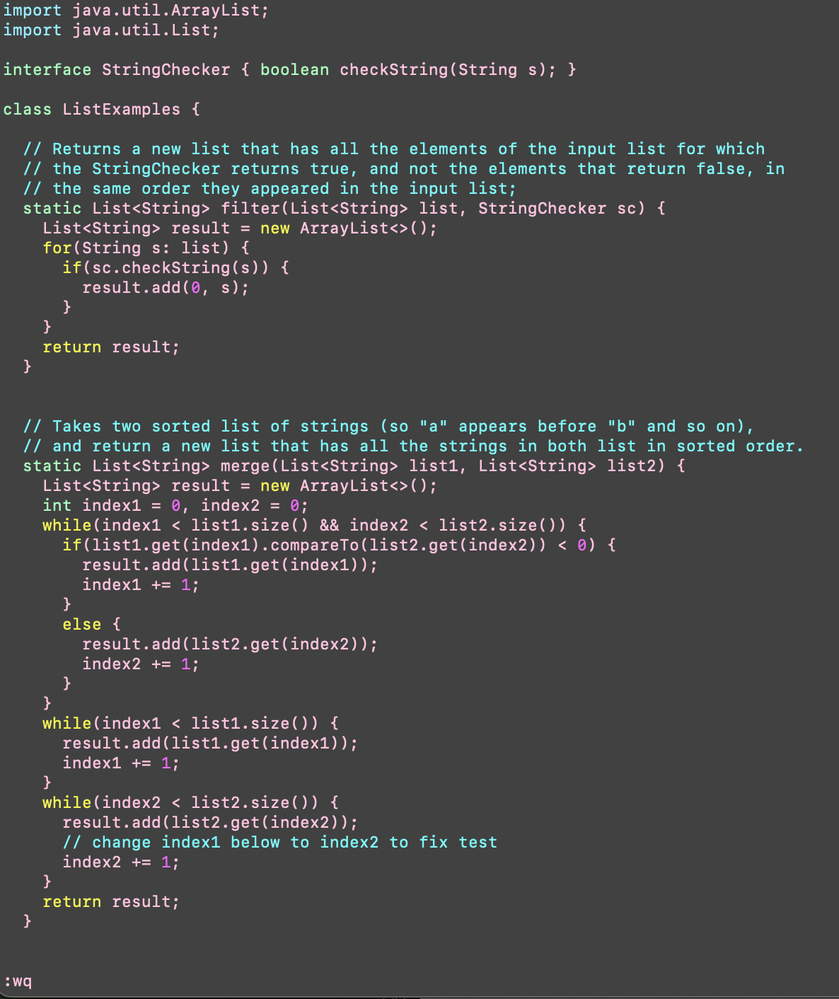

## Lab4: Doing it All From the Command Line

this report gives instructions on using vim/commandline to make different coding tasks more efficient.

### Log into ieng6

Keys pressed: `<up><enter>`

since `ssh zs15lsp23df@ieng.ucsd.edu` was the last thing I typed in the terminal, i could just press the up arrow to repeat it:

### Clone the Repository

Keys pressed: `git clone <command> v`

to clone the respository, i have to type the cloning command into the terminal, but then i can just paste the link into the command line after copying it, the line then reads `git clone https://github.com/zoesolomon/lab7.git`

### Run Tests

Keys pressed: `cd l <tab> <enter>`, `bash t <tab> <enter>` 

since the directory lab7 is the only one in my home directory that starts with l, i can just type l, then tab to fill in the rest of the line, which ends up being `cd lab7/`. Similarly, the test can be run by using tab to autofill the test script, which ends up being `bash test.sh` in the commandline

### Edit Code

Keys pressed: `vi L <tab> . <tab> <enter>`, `g43`, `e`, `r2`, `<esc> :wq <enter>`

similarly to the last step, the java file can be autofilled after the L and period, giving a commandline input of `vi ListExamples.java`. Then, `g43` can be used to go to the 43rd line in the file. Next, `e` can be used to go to the end of the current word, and `r2` replaces the 1 with a 2, and finally, `<esc> :wq <enter>` can be used exit insert mode, save and quit.

### Run Tests Again

Keys pressed: `bash t <tab> <enter>` 

the tests can be run again exactly like they were run before with the autofill, which ends up putting `bash test.sh` in the commandline

### Commit and Push

Keys pressed: `git add . <enter>`, `git commit -m "s" <enter>`, `git push origin main`

The first command adds all files to be pushd, the second to commit a new command "s", and the third to push to the main branch.

