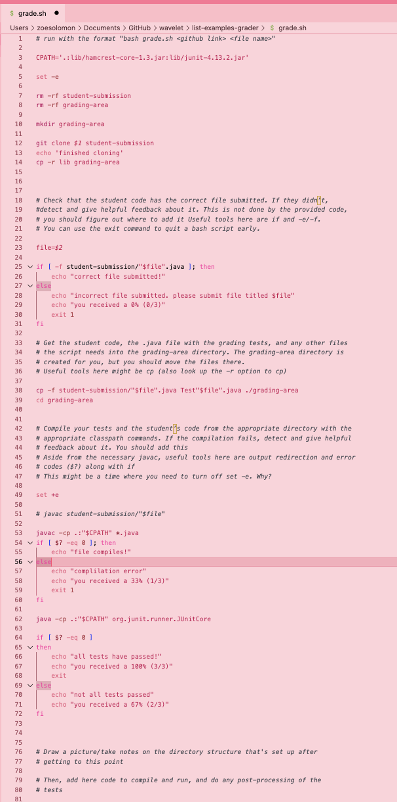
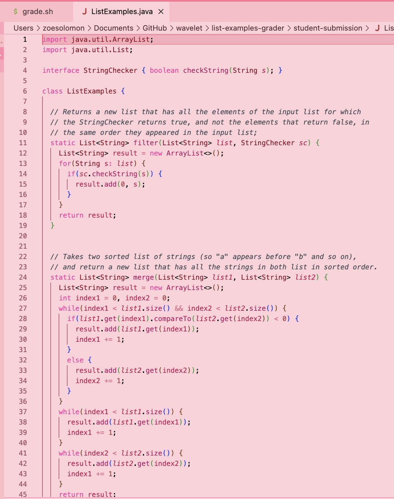

## Lab5: Putting it All Together

This report gives instructions for helping debugging a file.

## Part 1 – Debugging Scenario

Student Question:

What environment are you using (computer, operating system, web browser, terminal/editor, and so on)?

VSCode on a Macbook

Detail the symptom you're seeing. Be specific; include both what you're seeing and what you expected to see instead. Screenshots are great, copy-pasted terminal output is also great. Avoid saying “it doesn't work”.

0 tests are running, code recived 100% when it shouldn't.

input:
```
$ bash grade.sh https://github.com/ucsd-cse15l-f22/list-methods-lab3 ListExamples
```
output:
```
Cloning into 'student-submission'...
remote: Enumerating objects: 3, done.
remote: Counting objects: 100% (3/3), done.
remote: Compressing objects: 100% (2/2), done.
remote: Total 3 (delta 0), reused 3 (delta 0), pack-reused 0
Receiving objects: 100% (3/3), done.
finished cloning
correct file submitted!
file compiles!
JUnit version 4.13.2

Time: 0.002

OK (0 tests)

all tests have passed!
you received a 100% (3/3)
```

Detail the failure-inducing input and context. That might mean any or all of the command you're running, a test case, command-line arguments, working directory, even the last few commands you ran. Do your best to provide as much context as you can.

The code in the github link should receive a 2/3, as there is an error making the test in TestListExamples.java fail. However, JUnit isn't running this test, so the code passes with 3/3.


TA Response:

```
hey!

try looking at where the tests are being run in the code.
```

Student Answer:

after fixing the bug this was my output:

input:
```
bash grade.sh https://github.com/ucsd-cse15l-f22/list-methods-lab3 ListExamples
```
output:
```
Cloning into 'student-submission'...
remote: Enumerating objects: 3, done.
remote: Counting objects: 100% (3/3), done.
remote: Compressing objects: 100% (2/2), done.
remote: Total 3 (delta 0), reused 3 (delta 0), pack-reused 0
Receiving objects: 100% (3/3), done.
finished cloning
correct file submitted!
file compiles!
JUnit version 4.13.2
.E
Time: 0.572
There was 1 failure:
1) testMergeRightEnd(TestListExamples)
org.junit.runners.model.TestTimedOutException: test timed out after 500 milliseconds
        at java.base@17.0.3.1/java.util.Arrays.copyOf(Arrays.java:3512)
        at java.base@17.0.3.1/java.util.Arrays.copyOf(Arrays.java:3481)
        at java.base@17.0.3.1/java.util.ArrayList.grow(ArrayList.java:237)
        at java.base@17.0.3.1/java.util.ArrayList.grow(ArrayList.java:244)
        at java.base@17.0.3.1/java.util.ArrayList.add(ArrayList.java:454)
        at java.base@17.0.3.1/java.util.ArrayList.add(ArrayList.java:467)
        at app//ListExamples.merge(ListExamples.java:42)
        at app//TestListExamples.testMergeRightEnd(TestListExamples.java:17)

FAILURES!!!
Tests run: 1,  Failures: 1

not all tests passed
you received a 67% (2/3)
```

the bug was that I forgot to specify which file when running the JUnit tests, which led to 0 tests being run. This was fixed by adding Test"$file" to the end of line 62, which in the case of ListExamples (the file we were testing), becomes TestListExamples. 

The bash code before the fix:



The bash code after the fix:


The directory structure:


The code that should receive 2/3 points (in line 43 it adds to Index1 instead of Index2):



## Part 2 – Reflection

Something that I leanred from my lab experience was how to use github, and how useful it is, especially for things that require collaboration. Additionally, I learned how to create and utilize a server. 


